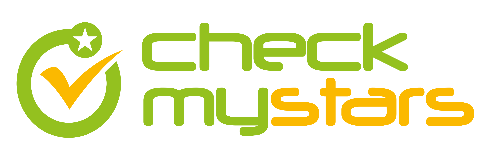
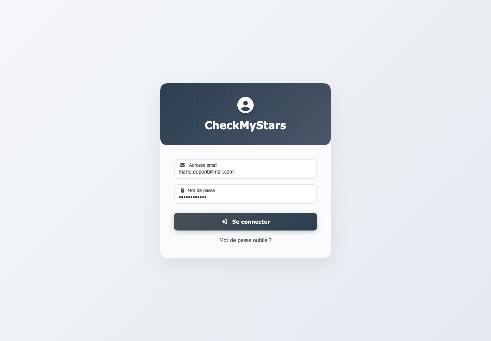
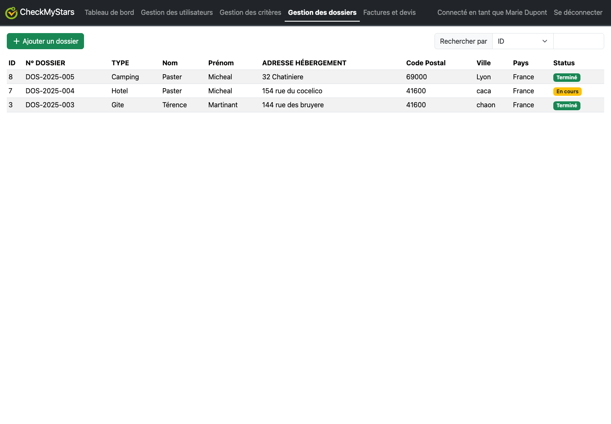
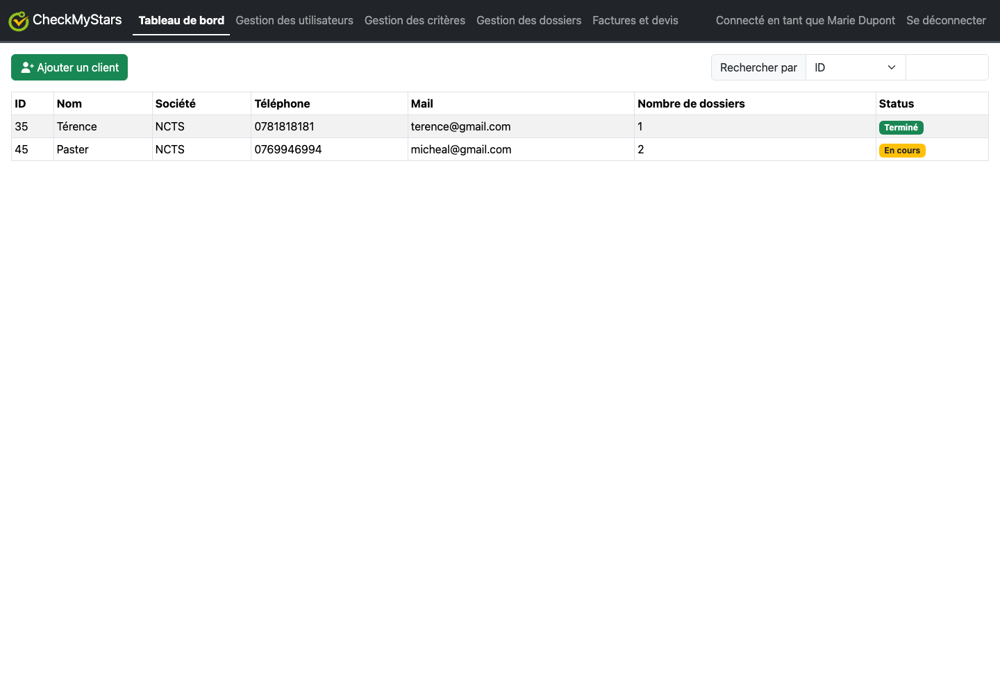
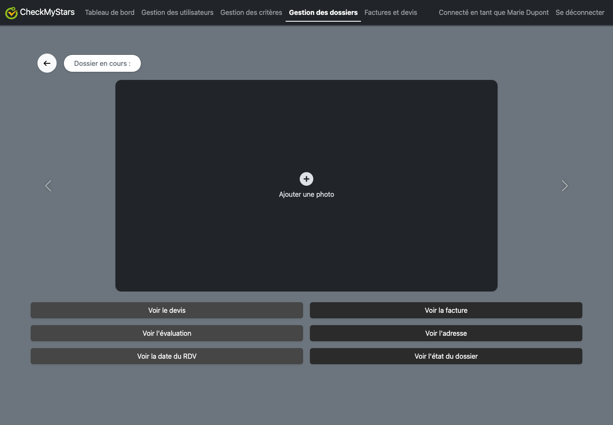
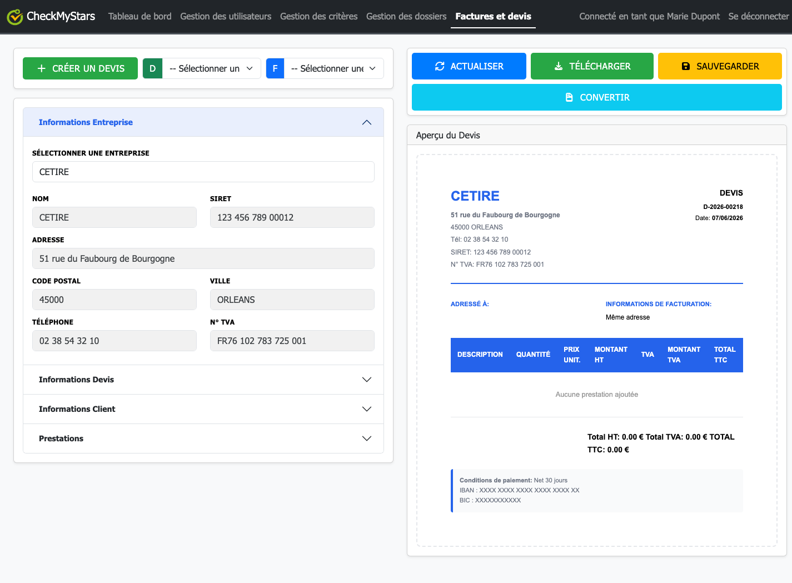
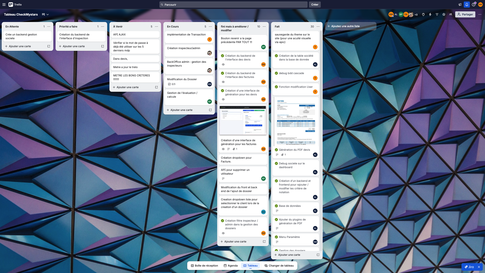

# CheckMyStars



Application web de gestion d'inspections et d'evaluation de biens d'hebergement, realisee dans le cadre du BTS SIO option SLAM.

Le projet permet de suivre le cycle complet d'une evaluation : gestion des utilisateurs et des societes, creation des dossiers, affectation d'inspecteurs, saisie des criteres de classement, suivi des devis/factures et generation de documents PDF.

## Contexte

CheckMyStars repond a un besoin de gestion interne pour une organisation chargee d'evaluer des biens d'hebergement. L'application centralise les informations des clients, des societes, des inspecteurs, des dossiers et des documents commerciaux.

Periode de realisation indiquee dans le tableau de synthese : du 13/11/2025 au 23/01/2026.

Le projet a ete mene en equipe avec un suivi de type Kanban sur Trello. La capture du tableau Trello montre notamment les colonnes `En attente`, `Priorite a faire`, `A venir`, `En cours`, `fini mais a ameliorer / modifier` et `Fait`, avec des taches sur les dossiers, les inspecteurs, les criteres, les devis, les factures, les societes et la base de donnees.

## Fonctionnalites principales

- Authentification des utilisateurs avec gestion des roles administrateur et inspecteur.
- Tableau de bord des clients avec recherche, ajout, modification et consultation.
- Gestion des societes rattachees aux utilisateurs.
- Gestion des inspecteurs et des comptes utilisateurs.
- Creation et suivi des dossiers d'evaluation.
- Consultation du detail d'un dossier avec photos, adresse, statut et inspecteur assigne.
- Gestion des criteres de notation par niveau d'etoiles.
- Saisie des evaluations par les inspecteurs.
- Creation de devis et factures avec lignes de prestation, TVA et total.
- Conversion d'un devis en facture avec verrouillage du document.
- Generation de PDF via TCPDF.
- Theme clair/sombre memorise par utilisateur.

## Technologies utilisees

- PHP 7.4+ pour le backend.
- MariaDB / MySQL pour la base de donnees.
- PDO pour l'acces aux donnees.
- HTML5, CSS3, JavaScript pour l'interface.
- Bootstrap 5.3 pour la mise en page et les composants.
- Font Awesome pour les icones.
- TCPDF pour la generation des PDF.
- Trello pour l'organisation projet.
- Git / GitHub pour le suivi de version et le partage du code.

## Installation locale

### Prerequis

- PHP 7.4 ou superieur.
- MariaDB ou MySQL.
- Apache, MAMP, XAMPP ou WAMP.
- Composer.

### Etapes

```bash
git clone https://github.com/wepurple/CheckmyStarsv2.git
cd CheckMyStars
composer install
```

Importer ensuite la base de donnees :

```bash
mysql -u root -p checkmystars3 < assets/sql/checkmystars3.sql
```

Configurer la connexion a la base avec les variables d'environnement suivantes si necessaire :

```bash
DB_HOST=127.0.0.1
DB_PORT=8889
DB_NAME=checkmystars3
DB_USER=root
DB_PASSWORD=root
```

Par defaut, le fichier `includes/mariadb.php` utilise les valeurs adaptees a MAMP : `127.0.0.1`, port `8889`, base `checkmystars3`, utilisateur `root`, mot de passe `root`.

Lancer ensuite le serveur local et ouvrir :

```text
http://localhost/CheckMyStars/
```

## Structure du projet

```text
CheckMyStars/
├── assets/
│   ├── pictures/                 # Logos
│   ├── img/                      # Images d'exemple
│   └── sql/checkmystars3.sql     # Script de creation et donnees SQL
├── bootstrap 5.3/                # Bootstrap local et CSS personnalises
├── criteres/                     # Gestion et saisie des criteres d'evaluation
├── factures/                     # Interface et generation PDF devis/factures
├── gestion/                      # Back-office dossiers, inspecteurs, utilisateurs
├── includes/                     # Connexion BDD, navbar, configuration serveur
├── js/                           # Scripts JavaScript et appels AJAX/fetch
├── models/                       # Traitements CRUD, API, lectures, mises a jour
├── documentation.html            # Documentation technique E5
├── dashboard.php                 # Tableau de bord clients
├── front_dossier.php             # Detail d'un dossier
├── index.php                     # Page de connexion
└── README.md                     # Documentation GitHub
```

## Modules realises

### Authentification et roles

L'authentification est traitee dans `login.php`. Le mot de passe saisi est verifie avec `password_verify`, puis la session stocke l'identite, le theme et les roles de l'utilisateur.

Les pages sensibles controlent les roles avant d'afficher le contenu. Par exemple :

- `gestion/gestion_dossiers.php` est accessible aux administrateurs et inspecteurs.
- `criteres/critereBack.php` est reserve aux administrateurs.
- `factures/facture.php` est accessible aux administrateurs et inspecteurs.
- `models/Create/users.php` refuse l'acces si l'utilisateur connecte n'est pas administrateur.

### Gestion des utilisateurs, clients et societes

Le tableau de bord `dashboard.php` affiche les clients, leur societe, leurs coordonnees, le nombre de dossiers et le statut global. Le fichier `js/dashboard.js` gere la recherche, les validations de formulaire, les appels `fetch`, les toasts et la creation de societe.

Le backend correspondant se trouve dans :

- `models/Create/users.php`
- `models/Create/company.php`
- `models/Read/infoDossier.php`
- `models/Update/users.php`
- `models/Delete/users.php`

### Gestion des dossiers

Le module `gestion/gestion_dossiers.php` liste les dossiers et adapte les donnees selon le role :

- un administrateur voit l'ensemble des dossiers via `Get_Dossier`;
- un inspecteur voit ses dossiers via `Get_Dossier_Inspecteur`.

Le detail d'un dossier est gere dans `front_dossier.php`. Cette page affiche le numero de dossier, les photos, l'adresse, le statut, l'inspecteur assigne et l'acces a l'evaluation.

### Evaluation et criteres

Les criteres sont geres depuis le dossier `criteres/` :

- `critereBack.php` affiche les statistiques par niveau d'etoile.
- `critereBackStar.php` permet de travailler sur une liste de criteres.
- `critere_inspecteur_etoile.php` et `critere_inspecteur_traitement.php` concernent la saisie d'evaluation par l'inspecteur.
- `models/Update/updateCriteria.php` et `models/Update/updateEvaluation.php` assurent les mises a jour.

La base contient les tables `criteres`, `listescriteres`, `listescriteres_etoiles`, `contient` et `evaluations`, ce qui permet de relier les criteres aux niveaux d'etoiles et aux dossiers.

### Devis, factures et PDF

Le module `factures/facture.php` permet de creer des devis, d'ajouter des prestations, de calculer les totaux et de selectionner les documents existants.

L'API interne `models/api/devis_api.php` expose plusieurs actions :

- `list_devis`
- `get_devis`
- `new_devis_number`
- `save_devis`
- `list_factures`
- `get_facture`
- `convert`
- `list_entreprises`
- `get_client_info`

Le fichier `models/api/helpers.php` centralise la connexion PDO, les reponses JSON, la recuperation complete des devis/factures et la generation de numeros uniques. La generation de numeros utilise une transaction et un verrou `FOR UPDATE` sur `document_counters`, afin d'eviter les doublons.

Les fichiers `factures/generate_devis_pdf.php` et `factures/generate_facture_pdf.php` utilisent TCPDF pour produire les documents PDF.

## Securite et qualite

Plusieurs mesures ont ete integrees :

- Connexion BDD centralisee dans `includes/mariadb.php`.
- Utilisation de PDO et de requetes preparees.
- Desactivation de l'emulation des requetes preparees avec `PDO::ATTR_EMULATE_PREPARES => false`.
- Encodage `utf8mb4`.
- Hashage des mots de passe avec `password_hash`.
- Verification des mots de passe avec `password_verify`.
- Controle des roles sur les pages et API sensibles.
- Validation cote client dans `js/dashboard.js`.
- Validation cote serveur dans les scripts `models/`.
- Protection des documents factures : une facture chargee est consideree en lecture seule et un devis converti est verrouille.
- Historique des anciens mots de passe via la table `old_passwords` et verification dans `models/user.php`.

## Justification des croix du tableau de synthese

Les croix indiquees dans le tableau de synthese concernent ce projet :

- `Gerer le patrimoine informatique`
- `Developper la presence en ligne de l'organisation`
- `Travailler en mode projet`

### C - Gerer le patrimoine informatique

Cette competence est justifiee par la mise en place, l'exploitation et la securisation des ressources applicatives et de la base de donnees.

Realisations associees :

- Creation et exploitation d'une base MariaDB complete avec tables, cles et contraintes dans `assets/sql/checkmystars3.sql`.
- Gestion des comptes utilisateurs, administrateurs, inspecteurs, proprietaires et donneurs d'ordre.
- Mise en place d'une connexion BDD centralisee et configurable via variables d'environnement dans `includes/mariadb.php`.
- Organisation des traitements CRUD dans `models/Create`, `models/Read`, `models/Update` et `models/Delete`.
- Gestion des droits d'acces selon le role connecte.
- Protection des comptes par hashage de mot de passe et controle des anciens mots de passe.
- Suivi des documents de gestion : devis, factures, dossiers, evaluations et photos.

Fichiers justificatifs :

- `includes/mariadb.php`
- `assets/sql/checkmystars3.sql`
- `login.php`
- `models/user.php`
- `models/Create/users.php`
- `gestion/gestion_utilisateurs.php`
- `gestion/gestion_inspecteurs.php`
- `gestion/gestion_dossiers.php`

Preuves visuelles :

La page de connexion montre que l'application n'expose pas directement les modules internes : l'utilisateur doit d'abord s'authentifier avant d'acceder au patrimoine applicatif.



La gestion des dossiers montre l'exploitation des ressources gerees par l'application : dossiers, proprietaires, biens, inspecteurs, statuts et suivi operationnel.



### E - Developper la presence en ligne de l'organisation

Cette competence est justifiee par le developpement d'une application web accessible depuis un navigateur, representant le service CheckMyStars et permettant aux utilisateurs de gerer l'activite de l'organisation.

Realisations associees :

- Creation d'une interface web complete en PHP, HTML, CSS, JavaScript et Bootstrap.
- Mise en place d'un parcours utilisateur : connexion, tableau de bord, gestion des dossiers, evaluations, devis et factures.
- Interface responsive grace a Bootstrap 5.3.
- Utilisation d'un logo et d'un theme graphique CheckMyStars.
- Ajout d'un theme clair/sombre memorise par utilisateur.
- Generation de documents PDF professionnels pour les devis et factures.
- Gestion dynamique des donnees via JavaScript, AJAX et API JSON internes.

Fichiers justificatifs :

- `index.php`
- `dashboard.php`
- `front_dossier.php`
- `bootstrap 5.3/css/style.css`
- `bootstrap 5.3/css/facture.css`
- `js/dashboard.js`
- `js/facture.js`
- `models/api/devis_api.php`
- `factures/generate_devis_pdf.php`
- `factures/generate_facture_pdf.php`

Preuves visuelles :

Le tableau de bord montre une interface web exploitable par l'organisation pour consulter ses clients, leurs societes, le nombre de dossiers et leur statut.



Le detail d'un dossier montre la mise en ligne d'un parcours metier complet autour d'un dossier d'evaluation : consultation, photos, adresse, statut et acces a l'evaluation.



Le module devis/factures montre la production de documents professionnels depuis l'application web, avec previsualisation et actions de sauvegarde, conversion et telechargement.



### F - Travailler en mode projet

Cette competence est justifiee par l'organisation collective du travail, le suivi d'avancement et la repartition des taches.

Realisations associees :

- Utilisation d'un tableau Trello en mode Kanban.
- Repartition des taches par colonnes : attente, priorite, a venir, en cours, a ameliorer/modifier, fait.
- Suivi des taches terminees : base de donnees, gestion des societes, dashboard, utilisateurs, dossiers, criteres de notation, devis, factures, generation PDF.
- Identification des taches en cours ou a ameliorer : transactions, back-office administrateur, filtres, API de suppression, modification du front/back.
- Travail collaboratif avec plusieurs membres identifies sur les cartes Trello.
- Utilisation de Git/GitHub pour conserver l'historique du code et partager le projet.

Preuves associees :

- Capture du tableau Trello : `docs/screenshots/trello-checkmystars.png`.
- Historique Git du projet.
- Organisation du code par modules fonctionnels.
- Documentation technique `documentation.html`.
- Ce README pour la documentation GitHub.

Preuve visuelle :

La capture Trello montre le suivi Kanban du projet avec les colonnes de priorisation, les taches en cours, les taches terminees, les ameliorations et les membres associes aux cartes.



## Correspondance entre taches Trello et code

| Tache Trello / besoin | Realisation dans le projet | Fichiers principaux |
| --- | --- | --- |
| Creation de la table societe dans la base de donnees | Table `societes`, rattachement aux utilisateurs et clients | `assets/sql/checkmystars3.sql`, `models/Create/company.php` |
| Debug societe sur le dashboard | Affichage et selection des societes dans le tableau de bord | `dashboard.php`, `js/dashboard.js` |
| Creation inspecteur/admin | Gestion des roles et des comptes | `login.php`, `models/Create/users.php`, `gestion/gestion_inspecteurs.php` |
| BackOffice admin : gestion des inspecteurs | Interface admin dediee aux inspecteurs | `gestion/gestion_inspecteurs.php` |
| Gestion des dossiers | Liste, creation, consultation et statut des dossiers | `gestion/gestion_dossiers.php`, `front_dossier.php` |
| Gestion de l'evaluation / calcul | Criteres par etoile et saisie inspecteur | `criteres/`, `models/Update/updateEvaluation.php` |
| Creation d'une interface de generation pour les devis | Formulaire devis et API JSON | `factures/facture.php`, `js/facture.js`, `models/api/devis_api.php` |
| Creation d'une interface de generation pour les factures | Conversion devis vers facture et consultation | `factures/facture.php`, `models/api/devis_api.php` |
| Generation du PDF devis | Generation PDF avec TCPDF | `factures/generate_devis_pdf.php` |
| Ajout du plugin / librairie de generation PDF | Dependence TCPDF via Composer | `composer.json`, `composer.lock` |
| Creation filtre inspecteur/admin dans la gestion des dossiers | Affichage des dossiers selon le role | `gestion/gestion_dossiers.php` |
| API pour supprimer un utilisateur | Suppression utilisateur | `models/Delete/users.php` |
| Menu Parametre | Profil et theme utilisateur | `parametres.php`, `profil.php`, `models/Update/updateTheme.php` |

## Base de donnees

La base `checkmystars3` contient notamment :

- `utilisateurs`
- `administrateurs`
- `inspecteurs`
- `proprietaires`
- `donneurordre`
- `societes`
- `adressespostales`
- `biens`
- `dossiers`
- `photos`
- `criteres`
- `evaluations`
- `devis`
- `devis_client`
- `devis_items`
- `factures_prixtotal`
- `facture_client`
- `facture_items`
- `document_counters`
- `old_passwords`

Les contraintes de cles etrangeres definies dans le script SQL permettent de maintenir la coherence entre utilisateurs, societes, dossiers, devis, factures et evaluations.

## Auteurs

Projet realise dans le cadre du BTS SIO option SLAM, promotion 2025-2026.

Equipe projet CheckMyStars.

## Note pedagogique

Ce depot sert de support de presentation pour une realisation professionnelle. Les sections de justification permettent d'expliquer les croix cochees dans le tableau de synthese de l'epreuve.
